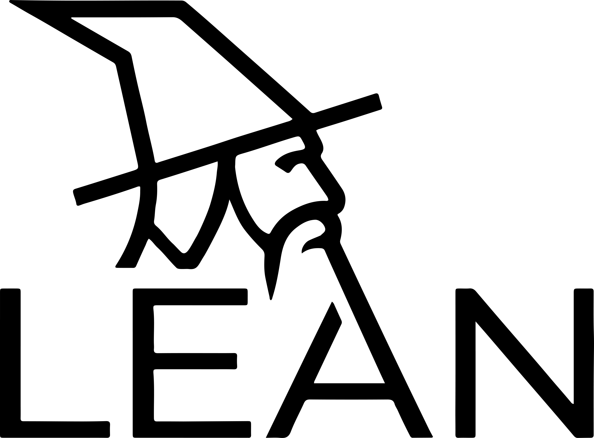

  

# MerLean-examples

Example output from [MerLean], a fully automated agentic framework that formalizes mathematical research papers into verified [Lean 4](https://lean-lang.org/) + [Mathlib](https://leanprover-community.github.io/) libraries and translates them back into human-readable LaTeX blueprints.

**Paper:** Yuanjie Ren\*, Jinzheng Li\*, Yidi Qi\*. *MerLean: An Agentic Framework for Autoformalization in Quantum Computation.

## What is this repository?

This repository contains the formalization output for **Paper B: Fault-Tolerant Quantum Computation** (Williamson, 2024), one of the three papers evaluated in the MerLean paper. It serves as a self-contained, browsable example of what MerLean produces.

- **QEC1/** -- Lean 4 library (47 files, ~18,500 lines) covering stabilizer codes, fault-tolerant protocols, Pauli algebra, transversal gates, gauging graphs, and measurement
- **blueprint/** -- Auto-generated [leanblueprint](https://github.com/PatrickMassot/leanblueprint) with dependency graph and LaTeX descriptions of every declaration

Browse the interactive blueprint at **[doxtor6.github.io/MerLean-examples](https://doxtor6.github.io/MerLean-examples/)**.

## How MerLean works

MerLean is a bidirectional pipeline powered by Claude:

1. **Autoformalization** (LaTeX → Lean 4): extracts mathematical statements from a paper, formalizes each into Lean declarations via an iterative compile-fix loop with faithfulness checking, and introduces explicit axioms where Mathlib lacks the required machinery.
2. **Autoinformalization** (Lean 4 → LaTeX): converts the verified library back into a human-readable blueprint so domain experts can review semantic alignment without Lean expertise.

Across three quantum-computing papers (114 statements), MerLean produced 2,050 Lean declarations totaling 41,000+ lines of verified code, achieving full formalization without axioms on two of three papers.

